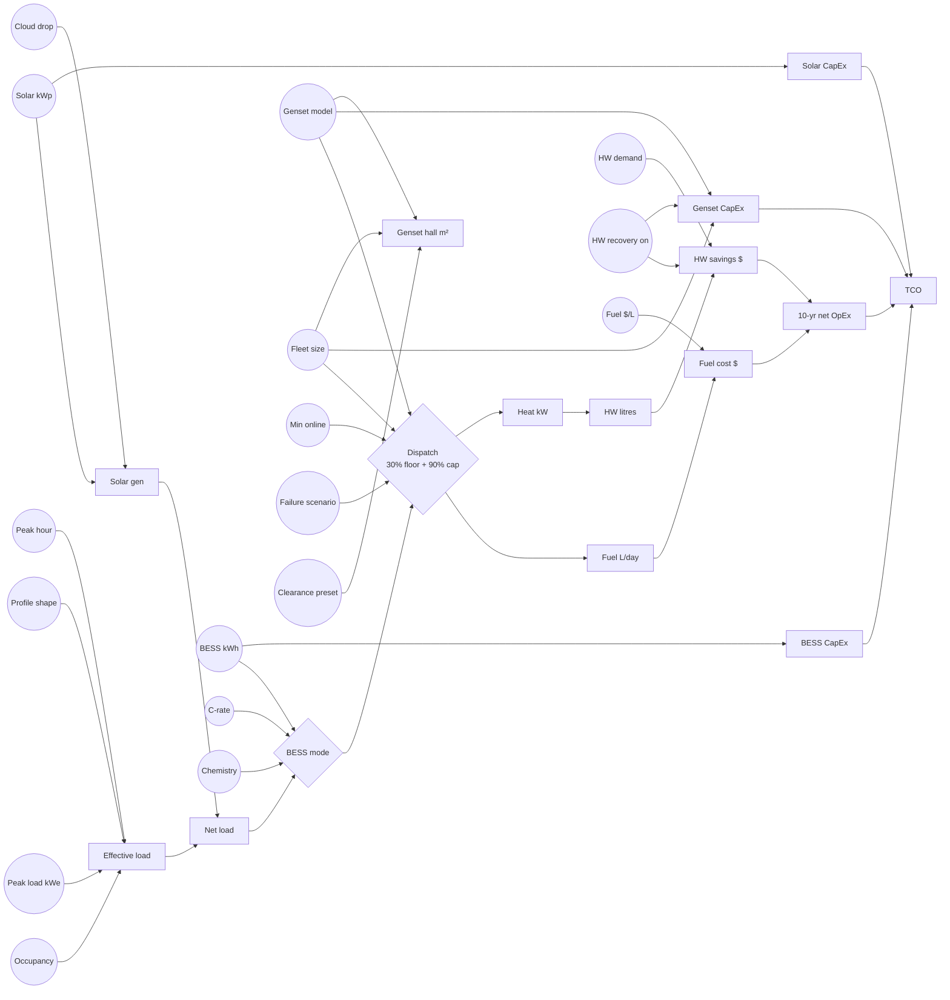

# MicroGrid Optimiser — Parameter Interactions

## Why there is no single right answer

Microgrid sizing has at least three axes that do not collapse cleanly into one number:

1. **Fuel cost** — how many litres of diesel across the horizon
2. **Physical footprint** — genset hall + BESS room + solar array m²
3. **Resilience** — what happens when one unit is down or one day is cloudy

A tool that reports "the optimal fleet" implicitly picks weights for these axes. This tool does not. It exposes the axes and lets the engineer pick. The purpose of this document is to make the non-obvious cross-axis interactions visible *before* you run a study, so you can design the right comparison.

### The four forcing functions

Most "counter-intuitive" findings trace back to one of these:

- **The 30% fuel floor** ([A-DISP-01](ASSUMPTIONS.md#dispatch--fuel-model)) — below 30% per-unit load, fuel is clamped to the 30% SFC. A single 2 MW genset serving 400 kW (20% load) burns fuel as if it were at 30% (600 kW). Drives the "fleet too big" result.
- **The 90% per-unit cap** ([A-DISP-02](ASSUMPTIONS.md#dispatch--fuel-model)) — a unit cannot carry more than 90% unless every unit is at 100%. Drives "add one more unit for N+1" decisions.
- **The BESS SoC window** ([A-BESS-03](ASSUMPTIONS.md#bess-model)) — only 85% of the usable capacity is actually cyclable (10%–95% SoC). A "200 kWh" BESS delivers ~170 kWh of round-trip service.
- **The midday solar overshoot** ([A-SOLAR-01](ASSUMPTIONS.md#solar-pv)) — solar peaks at noon, gensets must accept the resulting net-load dip, and the 30% floor fights back. Drives "solar + large gensets causes problems".

Hold these four in mind when reading the matrix below.

---

## Interaction matrix

Rows are **inputs**. Columns are **metrics displayed in the UI**. Each cell shows the *direction* of effect and a short note about the non-linearity. Arrows:

- `↑` = increases the metric
- `↓` = decreases the metric
- `~` = non-monotonic (has a sweet spot or cliff)
- `·` = essentially no direct effect

| Input ↓ / Metric → | Daily fuel (L) | Fuel/kWh efficiency | Genset hall m² | 10-yr TCO | N+X margin | Heat recovered | Solar curtailment |
|---|---|---|---|---|---|---|---|
| **Genset model** (larger kWe) | `~` smaller total at peak but worse at part-load (A-DISP-01) | `~` best in sweet zone, worse elsewhere | `↑` per-unit footprint | `~` cheaper CapEx/kW but higher fuel at part-load | `↓` fewer units → less redundancy | `~` more heat/unit, but capped by demand | `↑` large units push earlier into 30% floor |
| **Fleet size** (more units) | `↓` then `~` — gain diminishes and can reverse when bands shift | `↑` more staging flexibility, then flat | `↑↑` step-change at ≥6 (A-FP-02) | `↑` CapEx scales with unit count + HX per unit | `↑` linear | `~` more HX units capture more but each at lower utilisation | `↓` easier to turn down |
| **Min online** (forced units) | `↑` forces part-load | `↓` drags gensets below sweet zone | `·` | `↑` via fuel penalty | `↑` implicit reserve | `~` depends on load | `↓` more capacity to absorb |
| **Occupancy** | `↓` non-linearly (A-LOAD-02) | `↑` then `↓` — best in mid-occupancy sweet zone | `·` | `↓` | `↑` same fleet serves smaller load | `↓` less load → less fuel → less heat | `↑` lower load + same solar = more spill |
| **Profile shape** (flat→dual→single) | `~` dual and single raise peak fuel, flat smooths | `↑` flat, `↓` peaky | `·` | `~` peaky shapes penalise under-sized fleets | `·` | `~` | `~` shape changes the solar/load timing match |
| **Solar kWp** | `↓` linear to a point | `↑` until 30% floor hits, then flat | `·` (separate array footprint) | `~` CapEx competes with fuel savings | `·` | `↓` gensets run less → less heat | `↑↑` sharp above ~solar = base load |
| **Solar lock** | `·` | `·` | `·` | `·` | `·` | `·` | `·` (just fixes kWp) |
| **Solar drop %** | `↑` at higher drop (less solar produced) | `↓` slightly | `·` | `↑` | `·` | `↑` via more genset hours | `↓` |
| **BESS capacity** | `↓` then flat — diminishing returns | `↑` up to a point | `·` (separate BESS room) | `~` CapEx competes with fuel savings | `↑` small implicit reserve | `~` more load-levelling keeps gensets in band | `↓↓` solar absorbs into BESS |
| **BESS chemistry** (LFP vs NMC) | `↓` LFP (higher RTE, A-BESS-01/02) | `↑` LFP slightly | `↓` NMC (denser) | `~` trade LFP life vs NMC CapEx | `·` | `·` | `·` |
| **BESS C-rate** | `↓` only if shave events exist | `·` | `·` | `↑` higher C-rate costs more per real kWh | `·` | `·` | `·` |
| **BESS mode** | `~` different modes win in different regimes — see Workflow 4 | `~` | `·` | `~` | `~` Reserve mode adds margin | `·` | `~` Solar Buffer / Reserve dominate here |
| **Peak shave threshold** | `~` only binds if above threshold often | `·` | `·` | `~` | `·` | `·` | `·` |
| **Fuel cost** | `·` | `·` | `·` | `↑` linear | `·` | `·` | `·` |
| **HW recovery enabled** | `·` (same fuel burned) | `·` | `·` | `↓` savings; `↑` HX CapEx per unit (A-HEAT-05) | `·` | `↑↑` up to demand cap (A-HEAT-06) | `·` |
| **Nominal HW demand** | `·` (only matters with recovery on) | `·` | `·` | `↓` higher demand captures more savings up to availability | `·` | `↑` up to genset supply | `·` |
| **Failure scenario** | `↑` remaining units work harder | `↓` pushed toward/above sweet zone | `·` | `↑` (real-world scenario cost) | `↓↓` whole point of this toggle | `~` heat per unit changes | `·` |

> **Note on 10-yr TCO column:** From Cluster 6 onwards, the TCO total optionally includes electrical infrastructure CapEx when the Electrical CapEx modal has been used. The directional effects in the matrix above apply to the fuel and genset CapEx components of TCO. Electrical CapEx adds a separate dimension — fleet strategies with more generators pay more in cable runs and cubicles, but fewer large generators may pay more per ACB due to frame tier cliffs. See `ELECTRICAL_INFRA_MODAL_SPEC.md` for the full electrical cost model.

### Reading the matrix

When two rows both mark `~` for the same column, you have a tradeoff where either parameter can be tuned to fix the same issue — which is exactly where the decision-trees below help.

---

## Parameter interaction graph



Inputs are rounded, outputs are rectangular. Note how `fleet`, `genModel`, and `solarKwp` each fan out to three or more outputs — that is why no single axis ranks the strategies cleanly.

---

## Decision trees by customer priority

Use these as entry points into [WORKFLOWS.md](WORKFLOWS.md). Each leaf points to a specific worked example.

### If the customer cares most about **fuel cost**

```
Is fuel cost already low (<$0.80/L)?
├── yes → CapEx and footprint will dominate. Go to "space" tree.
└── no
    ├── Do they want to keep existing gensets?
    │   ├── yes → size solar + BESS around them.
    │   │        See Workflow 3 (solar + large gensets),
    │   │        then Workflow 4 (BESS mode).
    │   └── no → compare fleet shapes at their load.
    │            See Workflow 1 (many-small vs few-large).
    │            (also open Electrical CapEx modal — electrical infrastructure often inverts the few-big vs many-small ranking)
    └── Is load profile peaky (single or dual)?
        ├── yes → peaky loads reward BESS peak-shave +
        │          many-small fleets. See Workflow 4.
        └── no → flat loads favour few-large fleets in
                 sweet zone. See Workflow 1.
```

### If the customer cares most about **physical footprint**

```
Is there space for a solar array?
├── no → maximise genset density; avoid BESS.
│        Large-unit few-count fleets win.
│        See Workflow 2 (fleet breakpoint).
└── yes
    ├── Is hot-water demand significant?
    │   ├── yes → fewer large units + HW recovery — less HX
    │   │        CapEx, more recovered kWh per HX unit.
    │   │        See Workflow 5.
    │   └── no → density wins, but watch the 6-unit
    │            double-row step-change (A-FP-02).
    └── Is resilience required (>N)?
        ├── yes → add BESS in Reserve mode before a
        │          second unit. See Workflow 4 (Reserve).
        └── no → single large unit often wins on m².
```

### If the customer cares most about **resilience**

```
What is the required redundancy target?
├── N (no spare)
│   → check Workflow 2 to find the fleet size at which
│     fuel and footprint stop improving.
├── N+1
│   → ≥2 units required. Fewer, larger units minimise HX
│     CapEx but expose a larger share of load on failure.
│     See Workflow 1 with failure toggle on.
└── N+2 or more
    → many-small fleets start winning. Compare fuel
      and footprint trade vs 4–8 smaller units.
      See Workflow 1 and Workflow 2 together.
```

---

## Parameters not in the matrix (knobs that look benign but aren't)

- **Occupancy** quietly governs whether the sweet zone is reachable at all. A 100%-occupancy default on a 40%-occupancy site will invent an efficiency story that doesn't exist on the ground.
- **Profile shape** (`flat` / `dual` / `single`) selected once at the top and rarely revisited. Hospitality sites are usually `dual` or `single` with `peakHour = 18`; a `flat` shape represents an industrial comparator, not a resort.
- **Min online** is zero by default. Setting it above zero forces a reliability floor at the cost of fuel at low load — this is the lever for sites with regulatory minimum running requirements.
- **BESS O&M $/kWh/yr** can silently inflate 10-year TCO more than the capacity change does.
- **HW recovery toggle** enables both savings *and* HX CapEx per unit — the break-even depends on fleet size, not just HW demand.
