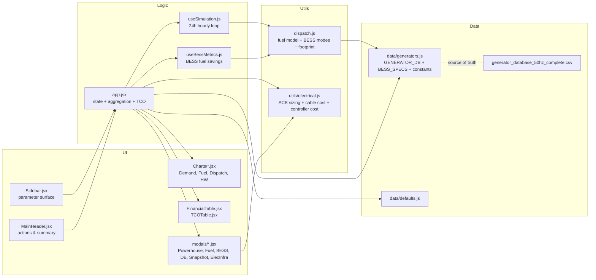
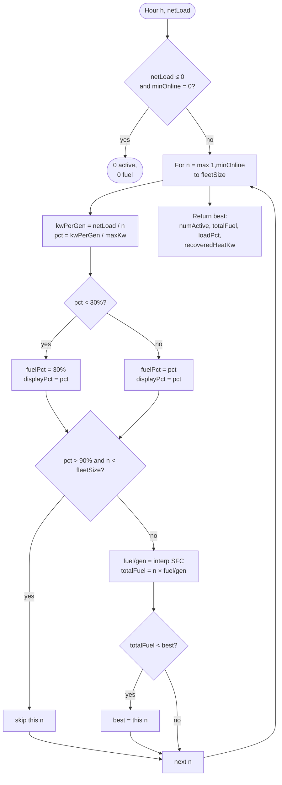
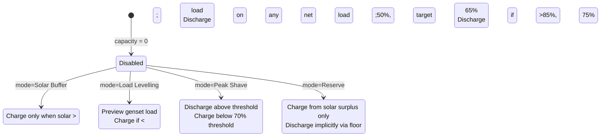

# MicroGrid Optimiser — Specification

## 1. Purpose

The MicroGrid Optimiser helps engineers and sales engineers compare up to three microgrid strategies side-by-side for an off-grid hospitality site. A "strategy" is a genset fleet (a model and a count), combined with a shared solar PV array, a shared BESS, and optional heat recovery.

The tool answers questions of the form *"given this load profile, which fleet shape leaves the fewest regrets across fuel, footprint, and resilience?"* — not *"what is the single optimal answer?"*. The solution space is deliberately multi-objective; see [PARAMETERS.md](PARAMETERS.md).

Default context: Maldives-class resort, 50 Hz gensets, tropical solar profile, hospitality hot-water pattern.

## 2. Non-goals

The tool is explicitly NOT:

- A real-time energy-management system (EMS)
- A steady-state electrical study (no power-flow, no fault analysis, no harmonic model)
- A grid-interconnect or utility-scale simulation
- A generator selection wizard (it compares fleets you propose, it does not invent them)
- A sub-hourly dynamic stability study (simulation runs in 1-hour steps)
- A weather-driven Monte-Carlo study (solar uses a deterministic sine + pseudo-random cloud cover; load uses a cosine shape)
- A genset derating tool (no altitude, ambient, or air-quality correction)

If a requirement lands outside this list, it belongs in a new branch, not a new parameter — see `SPEC.md` §13.

## 3. Architecture map



Key files:

- [../app.jsx](../app.jsx) — root React component, state, aggregation, TCO, redundancy
- [../src/hooks/useSimulation.js](../src/hooks/useSimulation.js) — 24-hour hourly loop: load shape, solar, BESS, dispatch for A/B/C
- [../src/hooks/useBessMetrics.js](../src/hooks/useBessMetrics.js) — BESS cycling, fuel savings, 10-year ROI
- [../src/utils/dispatch.js](../src/utils/dispatch.js) — `getFuelConsumption`, `optimizeDispatch`, `batteryDispatch`, `calcPowerhouseGeometry`
- [../src/data/generators.js](../src/data/generators.js) — generator DB (50+ models), BESS specs, heat constants, HW profile
- [../src/data/defaults.js](../src/data/defaults.js) — all `useState` initial values
- [../src/utils/electrical.js](../src/utils/electrical.js) — ACB frame selection, cable sizing, controller costs, electrical CapEx by fleet strategy
- [../src/components/modals/ElectricalInfraModal.jsx](../src/components/modals/ElectricalInfraModal.jsx) — three-strategy electrical infrastructure comparison, controller brand selection, TCO integration

## 4. Simulation model

### 4.1 Time resolution

The simulation runs a **deterministic 24-hour day in 1-hour steps** and extrapolates to daily, weekly, monthly, annual, 5-year, and 10-year totals via fixed multipliers ([app.jsx:236-243](../app.jsx#L236-L243)). There is no intra-hour dynamics, no seasonality, and no weather-year.

### 4.2 Load shape

Gross load at each hour = `effectiveBaseLoad + (effectivePeakLoad − effectiveBaseLoad) × loadFactor(hour)`, where `loadFactor` depends on the chosen profile shape ([useSimulation.js:34-44](../src/hooks/useSimulation.js#L34-L44)):

- **flat** — constant at 0.5
- **dual** — two peaks 12 h apart, cosine (phase offset `peakHour − 6`)
- **single** — one peak at `peakHour`, cosine over 24 h (offset `peakHour − 12`)

Base and peak are first scaled by occupancy (see §4.3).

### 4.3 Occupancy scaling

Occupancy (0–100%) scales nominal loads non-linearly ([app.jsx:147-155](../app.jsx#L147-L155)):

- `effectiveBaseLoad = baseLoad × (0.4 + 0.6 × occ)` — linear floor at 40%, representing fixed resort ops
- `effectivePeak = peakLoad × (0.2 + 0.8 × occ^1.5)` — convex, drops sharply with occupancy
- `effectiveHwDemand = dailyHwDemand × max(0.1, occ)` — floor at 10%

Peak is always enforced ≥ base + 50 kW. The 40%-base assumption matters: it is why a half-empty resort still looks "busy" to the dispatch model.

### 4.4 Three-strategy parallel evaluation

Every hour, the same `netLoad` is dispatched against three separate fleets (A, B, C). Each strategy has its own `{genModel, fleetSize, minRunning}`. Results flow to side-by-side charts, tables, and TCO. There is no cross-strategy interaction — strategies are independent what-ifs, not a federated power plant.

## 5. Dispatch algorithm



### 5.1 Fuel model

Specific fuel consumption (SFC) is stored per generator as four points at 25 / 50 / 75 / 100% load in [generators.js](../src/data/generators.js). Consumption at arbitrary load is **linear interpolation** between points, extrapolated linearly below 25% and clamped at 100% ([dispatch.js:14-29](../src/utils/dispatch.js#L14-L29)).

### 5.2 The 30% fuel floor

Below 30% load, fuel for the model is **clamped to the 30% SFC** ([dispatch.js:42](../src/utils/dispatch.js#L42)). This protects the model from unphysical fuel numbers at part-load where the 25% SFC point is already an extrapolation. The *display* load percentage stays at the true value — so a genset can show "running at 18%" while its fuel is computed as if at 30%. This is the single biggest reason small loads on large fleets look more expensive than a naive fuel-curve would suggest.

### 5.3 The 90% per-unit cap

A single unit cannot exceed 90% load unless *every* unit in the fleet is at 100% ([dispatch.js:47-51](../src/utils/dispatch.js#L47-L51)). This bakes in a safety margin and drives fleet-size decisions — adding one more unit often does nothing for fuel but buys back the 90% cap.

### 5.4 Dispatch preference

The selection criterion is **minimum total fuel**, not fewest units. In practice these often agree, but when they diverge the tool prefers fuel. Ties are broken by the iteration order (fewest units first wins).

### 5.5 Heat recovery per unit

`recoveredHeatKw = numActive × (heatKwAt100 × loadPct) × 0.70` ([dispatch.js:70](../src/utils/dispatch.js#L70)). Heat scales *linearly* with load in this model, which is a simplification — real recoverable heat is flatter than fuel.

## 6. BESS subsystem



### 6.1 Capacity accounting

- `bessPowerKw = cRate × capacityKwh`
- `bessUsableKwh = capacityKwh × DoD` (from chemistry spec)
- `minSocKwh = bessUsableKwh × 0.10`, `maxSocKwh = bessUsableKwh × 0.95` ([app.jsx:173-174](../app.jsx#L173-L174))

### 6.2 Round-trip efficiency is symmetric

Losses are applied equally on charge and discharge: `oneWayEff = √rte` ([dispatch.js:85](../src/utils/dispatch.js#L85)). This is a modelling choice, not a physical law — real asymmetries between charge and discharge efficiency are rolled into the single RTE number.

### 6.3 Mode-specific logic

See [dispatch.js:96-143](../src/utils/dispatch.js#L96-L143). The most involved mode is **Load Levelling**, which runs `optimizeDispatch` as a preview to see what the genset would do without the BESS, then acts to pull it into the 65–75% sweet band.

### 6.4 Universal safety clamp

When charging, the tool re-runs a dispatch preview with the charge power added to the load; if that pushes any unit above 90%, the charge power is reduced until the units land at or below 88% ([dispatch.js:148-158](../src/utils/dispatch.js#L148-L158)). This means a BESS cannot force a genset to stress-load just to absorb energy.

### 6.5 Simulation uses Strategy B as the dispatch preview

In the 24-hour loop, BESS behaviour is modelled against Strategy B's fleet ([useSimulation.js:68-74](../src/hooks/useSimulation.js#L68-L74)) — treated as the "median" strategy. Results for A and C use the same BESS output profile. When A and C fleet shapes differ significantly from B, the BESS dispatch does not retune per-strategy. This is a deliberate simplification to keep the three-way comparison comparable, but it distorts comparisons where A or C is dramatically different from B.

## 7. Heat recovery (CHP) model

- Recovery efficiency: **70%** of generator heat output is assumed recoverable ([generators.js:763](../src/data/generators.js#L763)).
- Water temperature rise: **40°C** ΔT ([generators.js:764](../src/data/generators.js#L764)).
- Energy-to-water conversion constant: **860** (kWh per °C × L, simplified from specific heat of water).
- HW demand is shaped over 24 hours by `HW_HOURLY_PROFILE` ([generators.js:768-774](../src/data/generators.js#L768-L774)) — a normalised hospitality pattern peaking in the evening.
- If HW recovery is enabled, recovered heat is capped at the period's HW demand ([app.jsx:258-260](../app.jsx#L258-L260)). Recovered heat beyond that is wasted.
- HX unit CapEx: **$4,000 per genset** ([app.jsx:319](../app.jsx#L319)), so a large fleet with HW recovery pays more CapEx even if the gensets are cheaper.

Electric-offset savings (when HW recovery is enabled) are computed via a closed-loop model: recovered litres → displaced electric heating kWh → displaced genset fuel at the 75% SFC point ([app.jsx:262-268](../app.jsx#L262-L268)).

## 8. Solar model

- **Hourly generation**: sine profile 06:00–18:00, peak at noon ([useSimulation.js:54-60](../src/hooks/useSimulation.js#L54-L60)).
- **Cloud variance**: pseudo-random via `|sin(hour × 13.37)|` scaled by the `solarDrop %` slider. Deterministic — same inputs, same output. Not a weather model.
- **Annual energy** (for LCOE): `solarKwp × 1825 × 0.80` ([app.jsx:529-531](../app.jsx#L529-L531)), where 1825 is Maldives peak-sun-hours/year and 0.80 is a tropical performance ratio.
- **Panel life**: 25 years with 0.5%/yr linear degradation ([app.jsx:527-528](../app.jsx#L527-L528)).
- **Land footprint**: 5.5 m²/kWp ([app.jsx:453](../app.jsx#L453)).
- **Cost**: user input, default $1.80/Wp ([defaults.js:37](../src/data/defaults.js#L37)).

Curtailment = solar available above the load that the BESS did not absorb ([useSimulation.js:82-85](../src/hooks/useSimulation.js#L82-L85)).

## 9. Redundancy model

Redundancy is classified as N+X, where N is the minimum fleet size needed to carry peak at 90%, and X is the excess. Classification lives inline in `app.jsx` near the quick-sizing buttons. The failure-scenario toggle ([app.jsx:95-104](../app.jsx#L95-L104)) drops one unit from each fleet's effective count and re-runs the whole simulation — so you can see how a fleet behaves with a unit in maintenance.

## 10. Powerhouse footprint

See [dispatch.js:173-219](../src/utils/dispatch.js#L173-L219). Three clearance presets:

| Preset | Side | Radiator | Control room | Wall | Row gap |
|---|---|---|---|---|---|
| Regulatory | 1.0 m | 1.0 m | 1.0 m | 1.0 m | 1.5 m |
| Practical | 1.5 m | 2.0 m | 1.2 m | 1.2 m | 2.5 m |
| Preferred | 2.0 m | 2.5 m | 1.5 m | 1.5 m | 3.0 m |

Layout switches to **Double Row** when `fleetSize ≥ 6` or (`fleetSize ≥ 4` and genset width ≥ 2.5 m); otherwise **Single Row** ([dispatch.js:184-187](../src/utils/dispatch.js#L184-L187)). Area is `totalW × totalH`, including walls and a 2.5 m control room.

This is geometric only. It does not account for fuel day tanks, bulk storage, switchgear rooms, or ventilation fans — those are shown separately in the Fuel System modal.

## 11. Electrical infrastructure modal

The electrical infrastructure modal (`ElectricalInfraModal.jsx`) computes the order-of-magnitude cost and technology consequence of each fleet strategy's electrical infrastructure. It is opened from the main header and presents three strategy columns side by side.

**Cost model — three tiers:**

- **Tier 1 — Per-generator cubicle:** ACB (frame selected by `genKWe × 1.804 × 1.25`), power cables (cross-section and parallel-run count by derated capacity), controller module, CTs, metering, enclosure. Scales with fleet size.
- **Tier 2 — Main distribution:** Main distribution ACB (sized to full installed fleet FLA — exceeds UAM regulatory minimum, provides power-creep headroom), busbar assembly, bus coupler when split bus is triggered at fleet ≥ 5.
- **Tier 3 — Site-level:** Site master controller, hybrid integration hardware (when BESS or solar active), earthing and surge protection, FAT.

**Three cost cliffs surfaced as flags:**
- ACB frame cliff (`genKWe ≳ 710 kWe`) — ACB specification exceeds 1,600A, entering the high-cost frame family (~2× unit price step).
- Split bus (`fleetSize ≥ 5`) — bus coupler ACB and bus-tie cubicle added; one-time step cost of ~$32,000–$51,000.
- Two-section panel (`panelLengthM > 4.5m`) — logistics consequence only; on-site busbar jointing required.

**Controller brand selection:**
User selects one brand (DSE / ComAp / DEIF) for all three strategies. When DSE is selected and BESS or solar is active in the main tool, a phasing narrative is displayed — DSE does not natively coordinate hybrid dispatch; a Phase 2 integration budget is included in the cost estimate so the total remains comparable to ComAp and DEIF.

**Cable run length:**
Derived from the user's selected layout mode (single row or double row) using a worst-case overspec: longest possible route × 1.35 routing overhead factor (`A-ELEC-29`). Run lengths are not computed from powerhouse geometry.

**Recomputation:**
The modal recomputes from scratch on every open. Electrical CapEx state in `app.jsx` is cleared when any fleet configuration changes (generator model, fleet size, BESS capacity, solar kWp). There are no quote overrides — all electrical infrastructure is `[estimated]`.

**TCO integration:**
A combined electrical CapEx line appears in the TCO table when the modal has been used. Supply or installed cost selectable via toggle (default: installed). Row is hidden when all three strategy values are null.

See `docs/ELECTRICAL_INFRA_MODAL_SPEC.md` for the full specification.

## 12. TCO model

```
TCO = gensetCapEx + solarCapEx + bessCapEx + 10yrNetOpEx + electricalCapEx
```

- `gensetCapEx = (genPrice + HX_COST) × fleetSize`, where `HX_COST = $4000` when HW recovery is enabled, else `$0` ([app.jsx:319-323](../app.jsx#L319-L323)).
- `electricalCapEx = grandInstalledCost` from `ElectricalInfraModal` when computed; zero when modal has not been opened or when fleet configuration has changed since last computation. Supply cost optionally substitutable via toggle. Carries `[estimated]` badge — no quote override.
- `bessCapEx = capacityKwh × effectiveCostPerKwh` (chemistry default or user quote override).
- `10yrNetOpEx = 10 × 365 × (dailyFuelCost − dailyHwSavings)`.
- `solarCapEx = solarKwp × solarCostPerWp × 1000`.

Notable absences: discounting (no NPV), inflation, O&M on gensets, fuel-price escalation, end-of-life replacement. TCO is a *comparison* number, not a lifecycle cost.

## 13. Known limitations & roadmap hooks

- Hourly resolution — no transient analysis, no primary/secondary frequency response
- Maldives-specific solar assumptions (PSH 1825, PR 0.80) — needs parametrisation for other climates
- No ambient / altitude derating on gensets
- No fuel logistics (delivery frequency, storage, price volatility)
- No BESS calendar life — degradation is in the spec but not applied to capacity over time
- Strategy B is the BESS dispatch reference — comparisons between very different A/B/C shapes drift
- Single day shape repeated for all 365 days — no seasonality
- Maintenance hours from CSV are stored but not used in TCO
- Electrical infrastructure cost model uses worst-case cable run overspec — actual run lengths from powerhouse geometry are not used; as-built runs may differ
- Controller cost ranges are planning-grade (±30%); verify against current distributor quotations at project stage
- Electrical O&M not modelled — consistent with genset O&M exclusion (A-TCO-06)

Branches likely to want new logic, not new inputs: grid-tied sites, industrial 24/7 loads, cold-climate derating, diesel+gas hybrid fleets, hydrogen.

## 14. Glossary

| Term | Meaning |
|---|---|
| **BESS** | Battery energy storage system |
| **CHP** | Combined heat and power (genset heat recovery to hot water) |
| **DoD** | Depth of discharge — fraction of nominal capacity that is usable |
| **HX** | Heat exchanger (the unit that captures genset waste heat) |
| **kVA vs kWe** | Apparent vs real electrical power — this tool works in kWe |
| **LCOE** | Levelised cost of energy — $/kWh over asset life |
| **N+1** | Fleet has one spare unit beyond peak demand |
| **PR** | Performance ratio — fraction of nameplate PV energy realised after losses |
| **PSH** | Peak-sun-hours/year — solar resource in kWh/m²/yr ÷ 1 kW/m² |
| **RTE** | Round-trip efficiency of a battery |
| **SFC** | Specific fuel consumption (L/h at a given load) |
| **SoC** | State of charge of a battery |
| **TCO** | Total cost of ownership — here: CapEx + 10-yr net OpEx |
